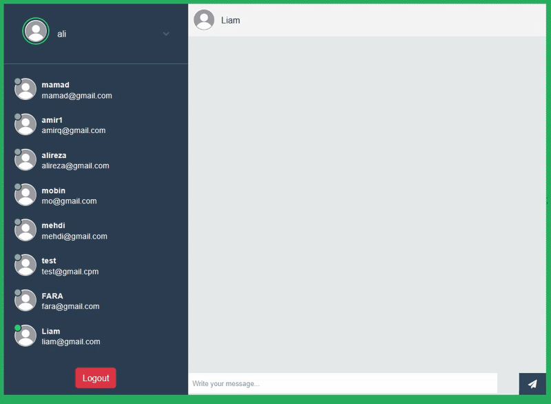

# 💬 Laravel Realtime Chat (Laravel 11 + Pusher + MySQL)
A real-time chat application built with **Laravel 11**, **Pusher**, and **MySQL**, featuring private messaging, online presence detection, and complete authentication powered by Laravel Breeze.

## ✨ Features
- 🔐 Full authentication (Register, Login, Email Verification, Password Reset)
- 💬 Realtime chat with **Pusher** and **Laravel Echo**
- 🟢 Presence channel for online users
- 🔒 Private user-to-user messaging
- 📦 Queue-based broadcasting for scalable realtime events
- 🧪 Testing with **Pest**
- 🧹 Code formatting with **Laravel Pint**
- 📡 Live application logs via **Laravel Pail**
- 🐳 Optional Docker environment with **Laravel Sail**

## 🎬 Demo




## 🛠 Tech Stack
- **Framework:** Laravel 11 (PHP 8.2+)
- **Database:** MySQL
- **Authentication:** Laravel Breeze
- **Realtime:** Pusher + Laravel Echo
- **Queue Driver:** Database / Redis
- **Tooling:** Pest, Pint, Pail, Sail, Vite

## ⚙️ Installation
### 1️⃣ Clone & Install
```bash
git clone https://github.com/Theseyqal/laravel-chat-app.git
cd <repo>
composer install
npm install
```
### 2️⃣ Environment Setup
```bash
cp .env.example .env
php artisan key:generate
```
### 3️⃣ Database Configuration
In `.env`:
```
DB_CONNECTION=mysql
DB_HOST=127.0.0.1
DB_PORT=3306
DB_DATABASE=chat_app
DB_USERNAME=root
DB_PASSWORD=your_password
```
Then run:
```bash
php artisan migrate
```
### 4️⃣ Queue & Broadcasting
In `.env`:
```
BROADCAST_DRIVER=pusher
QUEUE_CONNECTION=database
```
Create queue tables:
```bash
php artisan queue:table
php artisan migrate
```
### 5️⃣ Pusher Configuration
```
PUSHER_APP_ID=your_app_id
PUSHER_APP_KEY=your_key
PUSHER_APP_SECRET=your_secret
PUSHER_HOST=
PUSHER_PORT=443
PUSHER_SCHEME=https
PUSHER_APP_CLUSTER=eu
```
### 6️⃣ Run the Application
```bash
composer run dev
# or manually
php artisan serve
php artisan queue:listen --tries=1
php artisan pail --timeout=0
npm run dev
```
Visit: **http://localhost:8000**

## 🔌 Broadcasting Channels
```php
Broadcast::channel('message.{id}', function ($user, $id) {
    return (int) $user->id === (int) $id;
});
Broadcast::channel('online', function ($user) {
    return $user->toArray();
});
```

## 🧩 Example (Laravel Echo)
```js
// Private message channel
Echo.private(`message.${userId}`).listen('NewMessage', e => {
  console.log('New message:', e);
});
// Presence channel
Echo.join('online')
  .here(users => console.log('Online users:', users))
  .joining(user => console.log(`${user.name} joined`))
  .leaving(user => console.log(`${user.name} left`));
```

## 🧪 Testing
```bash
php artisan test
# or
./vendor/bin/pest
```

## 🧹 Code Style
```bash
./vendor/bin/pint
```

## 🚀 Roadmap
- [x] Authentication (Breeze)
- [x] Realtime private messaging
- [x] Online presence via Pusher
- [x] Queue-based broadcasting
- [ ] Chat rooms & group messages
- [ ] File and media attachments
- [ ] Notifications
- [ ] Deployment to Render/AWS

## 👤 Author
** Ali Ghanbarzadeh (TheSeyqal)**  
SaaS & MVP Builder | Tech Content Creator | Educator

### 🌐 Socials  
[LinkedIn](https://www.linkedin.com/in/alighanbarzadeh) | [YouTube](https://www.youtube.com/@theseyqal) | [X](https://x.com/TheSeyqal) | [TikTok](https://www.tiktok.com/@theseyqal) | [GitHub](https://github.com/Theseyqal) 
